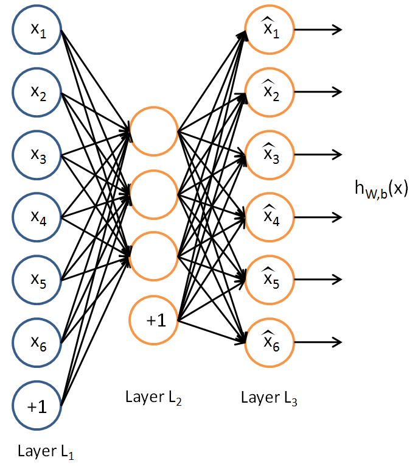

# Sparse Autoencoder with Vectorization

The purpose of this exercise is to implement a 3-layer sparse autoencoder with the help of vectorization of matrix operations during forward propagation and backpropagation.

Implemented functions are: [sampleIMAGES.m](sampleIMAGES.m), which samples the MNIST images to return 10000 of 28x28 patches as input for the subsequent functions; [sparseAutoencoderCost.m](./sparseAutoencoderCost.m) which calculates cost, weight decay, sparse penalty term and gradients; and [computeNumericalGradient](./computeNumericalGradient.m), which checks the numerical gradient calculated by the cose function.

To execute the code, run [train.m](./train.m), which carries out the following steps:

0. Initialise constants and parameters
1. Execute sampleIMAGES
2. Execute sparseAutoencoderCost
3. Gradient checking
4. After verifying the correctness of sparseAutoencoderCost function, start training the sparse autoencoder
5. Visualization of the hidden layer.

The features hidden layer picked up can be seen [here](./weights.jpg).

[Concepts and More Details](http://ufldl.stanford.edu/tutorial/unsupervised/Autoencoders/)